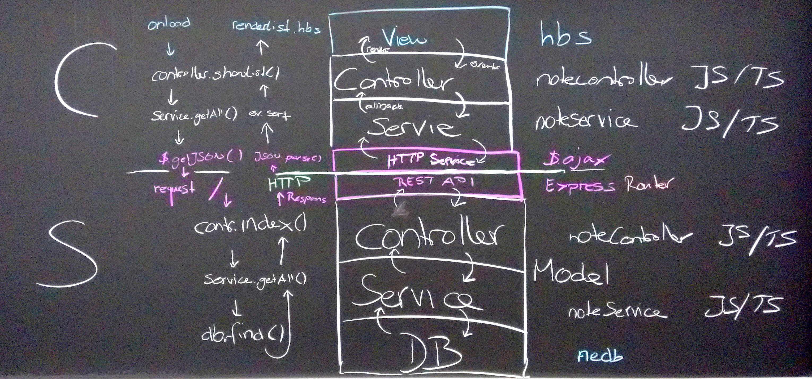
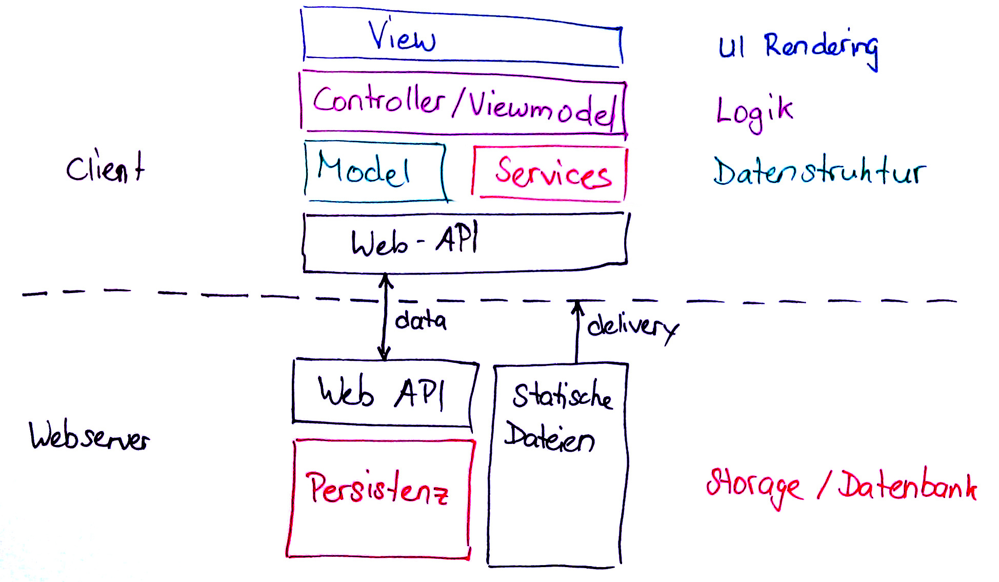
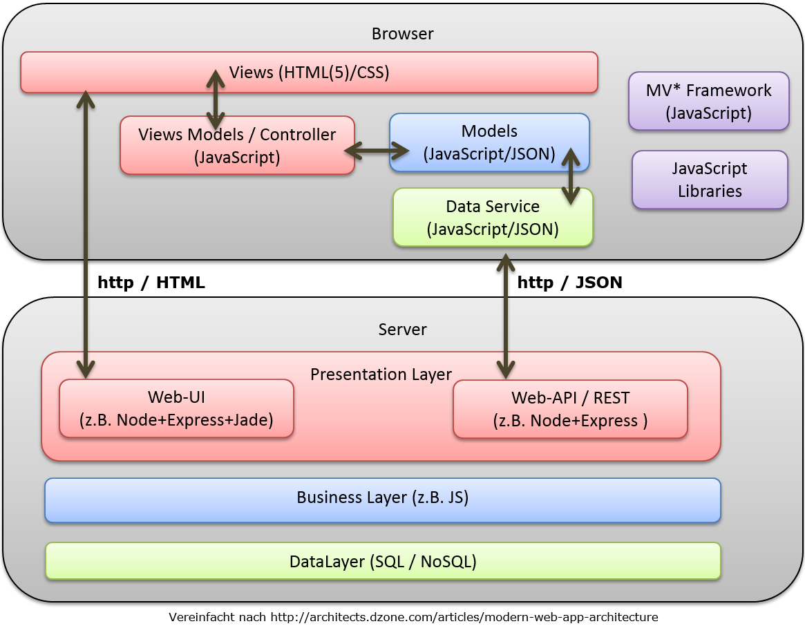

# Testing & Dependencies

[⇱ project1-architecture.jpg](./project1-architecture.jpg)

[⇱ pattern-spa.jpg](./pattern-spa.jpg)

[⇱ SPA-architecture-example.png](./SPA-architecture-example.png)

* How to test a service depending on a HTTP library?
* How to test a controller depending on a service?

## Exercise

[Test doubles exercise](./Exercise-Doubles.md)
